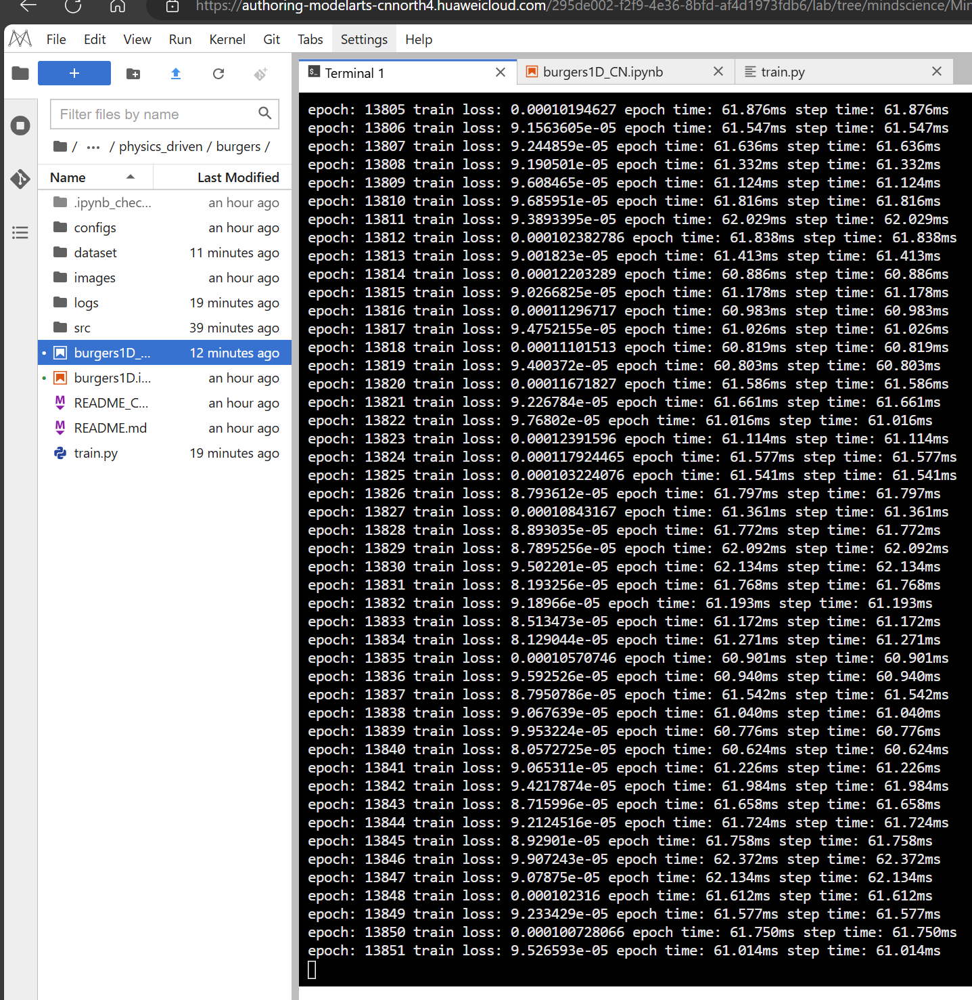
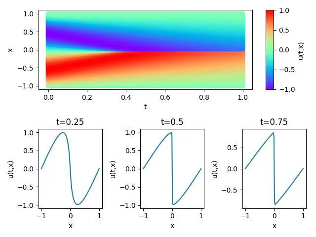

# 	PINNs方法在一维burges方程上的实现

## 1.  概述

1.伯格斯方程（Burgers' equation）是一个模拟冲击波的传播和反射的非线性偏微分方程，被广泛应用于流体力学，非线性声学，气体动力学等领域，它以约翰内斯·马丁斯汉堡（1895-1981）的名字命名。本案例采用MindFlow流体仿真套件中基于物理驱动的PINNs (Physics Informed Neural Networks)方法，求解一维情况下的Burgers方程。

2.PINN方法，全称为Physics-Informed Neural Networks（物理信息神经网络），是一种结合了物理模型和神经网络的机器学习方法。该方法的主要目的是解决涉及偏微分方程（PDE）的问题，特别是非线性、复杂几何形状和边界条件的问题。PINN方法通过将物理信息融入到神经网络中，以提高求解PDE问题的效率和准确性。


## 2. 数据集介绍

本实验使用mindflow样例中提供的Bugers.npy采样数据作为数据集。该数据集位于[physics_driven/burgers_pinns/dataset](https://gitee.com/link?target=https%3A%2F%2Fdownload.mindspore.cn%2Fmindscience%2Fmindflow%2Fdataset%2Fapplications%2Fphysics_driven%2Fburgers_pinns%2Fdataset%2F)目录下。


## 3. 训练环境

Modelarts平台介绍：

ModelArts是面向AI开发者的一站式开发平台，提供海量数据预处理及半自动化标注、大规模分布式训练、自动化模型生成及端-边-云模型按需部署能力，帮助用户快速创建和部署模型，管理全周期AI工作流。本实验在modelarts实验平台的基础上展开，实验环境的配置与参数如下文所示。


python版本：

```
python3.9.11
```

安装依赖包（modalarts平台自带的依赖库环境已经可以支持程序运行，这里只展示关键依赖库及其版本信息）：

```
Package                          Version
-------------------------------- ------------------------
huaweicloudsdkcore               3.1.96
huaweicloudsdkcsms               3.1.96
mindinsight                      2.0.0rc1
mindquantum                      0.8.0
mindspore                        2.0.0rc1
mindflow-gpu                     0.2.0
mock                             4.0.3
modelarts                        1.4.20
numpy                            1.24.2
pandas                           2.0.3
```

其中华为自研库的安装方法可参考所给出的链接：[mindspore安装](https://www.mindspore.cn/install/)

​																					 [mindflow安装](https://www.mindspore.cn/mindflow/docs/zh-CN/r0.1.0-alpha/mindflow_install.html)

该项目的文件目录树如下：

```
burges
|____images
| |____result.jpg
|____dataset
| |____Burgers.npz
|____README.md
|____configs
| |____burgers.yaml
|____train.py
|____src
| |______init__.py
| |____model.py
| |____dataset.py
| |____utils.py
```


GPU信息：

| 名称            | 参数      |
| --------------- | --------- |
| Driver Version: | 470.57.02 |
| CUDA Version    | 11.4      |
| GPU             | Tesla T4  |


## 4. 启动方式

在目录中找到train.py文件所在位置，并给出所需的参数值开始训练。

```
python train.py --config_file_path ./configs/burgers.yaml --mode GRAPH --device_target Ascend --device_id 0
```

其中，

`--config_file_path`表示参数文件的路径，默认值'./configs/burgers.yaml'；

`--mode`表示运行的模式，'GRAPH'表示静态图模式, 'PYNATIVE'表示动态图模式，默认值'GRAPH'；

`--device_target`表示使用的计算平台类型，可以选择'Ascend'或'GPU'，默认值'Ascend'；

`--device_id`表示使用的计算卡编号，可按照实际情况填写，默认值0；


### 代码实现

```
"""train process"""

from mindflow.cell import MultiScaleFCSequential

def train():

  '''Train and evaluate the pinns network'''

  \# load configurations

  config = load_yaml_config(args.config_file_path)


  \# create dataset

  burgers_train_dataset = create_training_dataset(config)

  train_dataset = burgers_train_dataset.create_dataset(batch_size=config["data"]["train"]["batch_size"],

​                             shuffle=**True**,

​                             prebatched_data=**True**,

​                             drop_remainder=**True**)

  \# create test dataset

  inputs, label = create_test_dataset(config["data"]["root_dir"])


  \# define models and optimizers

  model = MultiScaleFCSequential(in_channels=config["model"]["in_channels"],

​                  out_channels=config["model"]["out_channels"],

​                  layers=config["model"]["layers"],

​                  neurons=config["model"]["neurons"],

​                  residual=config["model"]["residual"],

​                  act=config["model"]["activation"],

​                  num_scales=1)
```

由于modelflow内部已经集成了相应的网络结构，只需要提供相应参数就可以构建出网络结构与训练流程。


### 参数选择

```
data:

 name: Burgers1D

 root_dir: "./dataset"

 train:

  batch_size: 8192
  epochs: 15000

 domain:

  size: 8192
  random_sampling: **true**
  sampler: "uniform"

 BC:

  size: 8192
  random_sampling: **true**
  sampler: "uniform"

 IC:

  size: 8192
  random_sampling: **true**
  sampler: "uniform"

 time:

  size: 8192
  random_sampling: **true**
  sampler: "uniform"

geometry:

 coord_dim: 1
 time_dim: 1
 coord_min: -1.0
 coord_max: 1.0
 time_min: 0.0
 time_max: 1.0

model:

 name: MLP_with_Residual
 in_channels: 2
 out_channels: 1
 activation: tanh
 layers: 12
 neurons: 128
 residual: **true**
 load_ckpt: **false**

optimizer:

 name: Adam
 learning_rate: 0.0001
 warmup_epochs: 1
 weight_decay: 0.0
 gamma: 0.5

loss:

 train:

  name: MSE

summary:

 root_dir: "./summary"
 ckpt_dir: "./summary/checkpoints
 save_ckpt: **false**
 eval_interval_epochs: 100
 save_checkpoint_steps: 50
 keep_checkpoint_max: 10
 visual_resolution: 100
```


## 5. 运行结果

运行train.py后，在modelarts环境输出结果如下：




所得burges方程的拟合解效果如下图所示：





​	

​			


